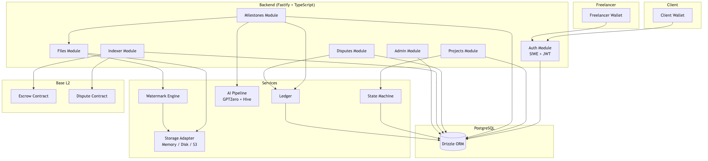
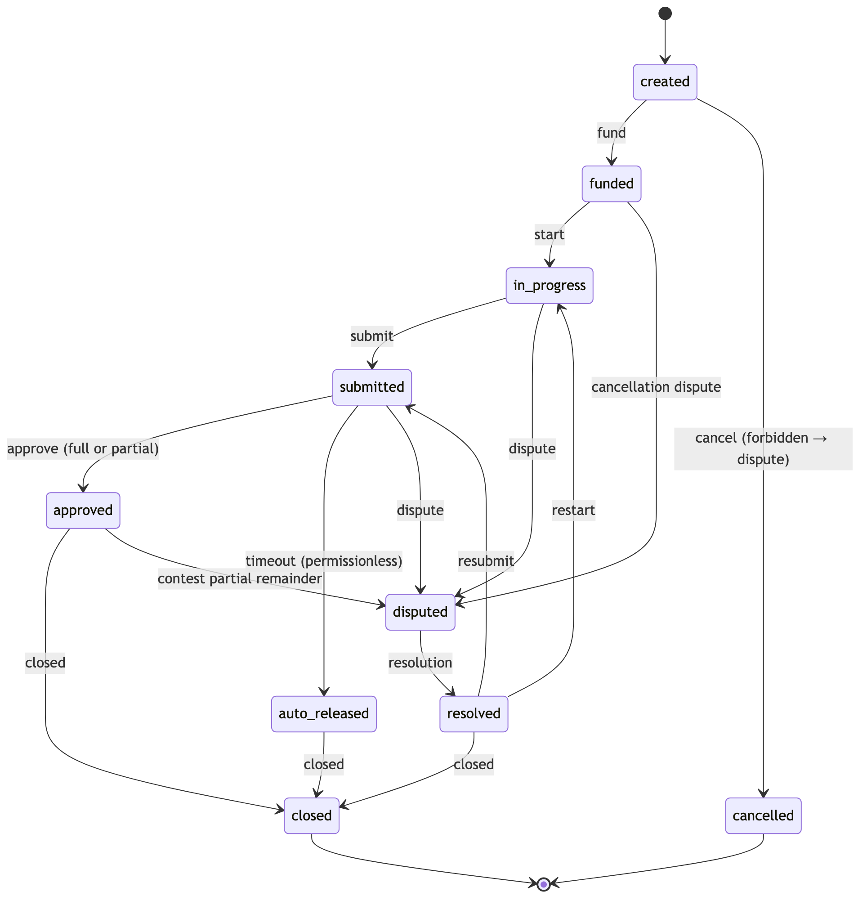
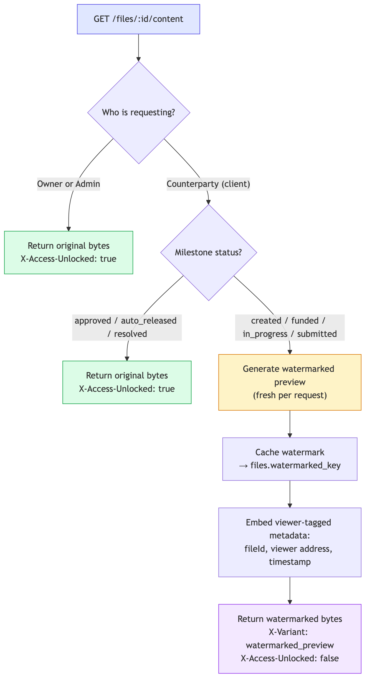
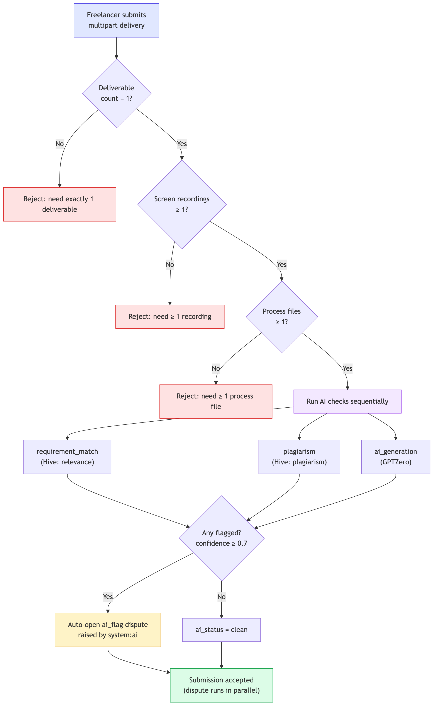
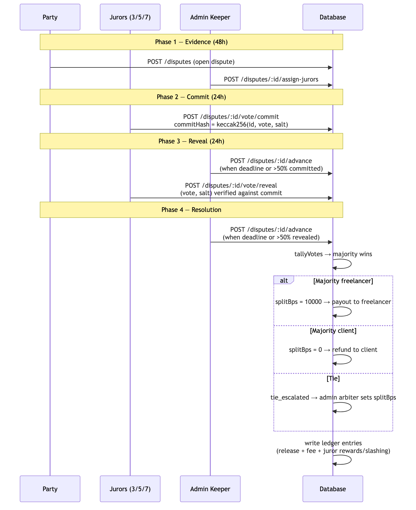
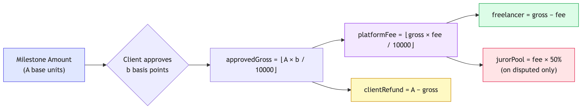

# Escrow: Trustless Milestones for Freelance Work

**A Technical Whitepaper — Escrow Protocol v0.1**

*Stablecoin escrow · Proof-of-work submissions · AI-assisted verification · Commit–reveal juries*

---

## §1 Abstract

Freelance work runs on an awkward bargain: someone must move first. The client who pays upfront risks receiving nothing; the freelancer who delivers first risks never being paid. Existing platforms resolve this with a corporate intermediary that holds funds, adjudicates conflict behind closed doors, and extracts rents from both sides.

**Escrow** replaces the intermediary with a protocol. A client locks the full project value into escrow *before work begins*. Funds move to the freelancer only when one of three things happens: the client approves a milestone, a review timeout expires and anyone may trigger release, or a jury of peers resolves a dispute. Three design commitments run through every mechanism:

1. **Evidence over assertion.** Submissions must carry proof-of-work artifacts — exactly one deliverable, screen recordings, process files — pinned by content hashes, so that "I did the work" is a verifiable claim rather than a promise.
2. **AI as signal, jury as verdict.** Machine checks (requirement match, plagiarism, AI generation) screen every submission, but a flag never blocks payment by itself; it opens a dispute for human adjudication.
3. **Skin in the game without capital lockup.** Jurors are rewarded from platform fees when they side with majorities and slashed when they dissent, using non-transferable reputation stakes — incentive alignment without token-economic attack surface.

The protocol ships in two modes: `CHAIN_MODE=off`, where a backend ledger holds custody for development, and `CHAIN_MODE=live`, where an event indexer mirrors Base-chain escrow and dispute contracts into Postgres. The off-chain API surface does not change between modes.

### 1.1 Comparison with the Status Quo

| Dimension | Traditional platforms | Escrow |
|---|---|---|
| Custody | Corporate account | Escrow lock, contract-backed in live mode |
| Dispute resolution | Opaque internal team | Commit–reveal jury, on-chain-auditable in live mode |
| Payment timing | Net-30/60 or platform whim | Per-milestone, deadline-enforced auto-release |
| Work quality signals | Ratings after the fact | PoW evidence + AI screening before payment |
| Fee destination | Platform keeps 100% | 50% of fee funds juror rewards |

---

## §2 Architecture

### 2.1 Design Principles

- **One state machine, enforced everywhere.** Every milestone transition passes through `assertTransition()`; illegal moves throw. There is no code path that skips steps.
- **Money is BigInt or it isn't money.** All amounts are integer base units computed with BigInt end-to-end; floats never touch balances.
- **Every mutation leaves a ledger trail.** Balances are reconstructed by summing append-only entries, making any state auditable after the fact.
- **Degrade gracefully.** AI provider outages, missing chain config, absent storage backends — each has a defined fallback so the core lifecycle never blocks.

### 2.2 Technology Stack

| Layer | Choice |
|---|---|
| Runtime | Node ≥ 20, TypeScript (ESM) |
| HTTP | Fastify v5 (`@fastify/cors`, `@fastify/jwt`, `@fastify/multipart`) |
| Validation | Zod v3 — request bodies *and* environment config |
| Database | PostgreSQL via Drizzle ORM; Neon serverless in production, embedded PGlite for zero-config dev/tests |
| Chain | viem v2 against Base (mainnet 8453 / Sepolia 84532) |
| Storage | Pluggable adapter: memory, disk, S3 |
| Media | sharp (image watermarking), pdf-lib (PDF watermarking) |
| Tests | Vitest — unit, E2E, concurrency/stress suites |

### 2.3 Module Map

```
src/
├── modules/          HTTP layer
│   ├── auth/         wallet challenge/verify, JWT plugin
│   ├── projects/     creation, funding, cancellation guard
│   ├── milestones/   start / submit / approve / auto-release
│   ├── disputes/     evidence → commit → reveal → resolve
│   ├── files/        upload + access-gated download
│   ├── admin/        token allowlist, juror approval
│   └── indexer/      Base event poller (live mode)
├── services/         domain logic
│   ├── statemachine.ts   transition table + assertTransition()
│   ├── ledger.ts         single-leg audit ledger per milestone
│   ├── ai/provider.ts    pluggable AI check providers
│   ├── storage.ts        Memory/Disk/S3 storage adapters
│   ├── watermark.ts      preview watermarking engine
│   ├── disputes.ts       dispute domain service
│   └── notifications.ts  in-DB notification rows
├── lib/
│   ├── money.ts      BigInt math, splits, commit-reveal hashing
│   └── chains.ts     viem clients, EIP-191 sign-in messages
└── db/               schema, portable SQL migrations, dual driver
```

`buildApp()` initializes the database, applies sorted SQL migrations tracked in `schema_migrations`, seeds the token allowlist, and starts the indexer poller when configured.



---

## §3 Project & Milestone Lifecycle

### 3.1 State Machine

A project contains **1–50 ordered milestones**, each independently specified (title + spec ≤ 8,000 chars), funded, reviewed, and disputable. Each milestone lives inside an explicit transition table:

```
created       → funded | cancelled
funded        → in_progress | disputed          (cancellation dispute)
in_progress   → submitted | disputed
submitted     → approved | auto_released | disputed
approved      → closed | disputed               (contest partial remainder)
auto_released → closed
resolved      → closed | in_progress | submitted
disputed      → resolved                        (only via resolution)
closed, cancelled → []                          (terminal)
```



Four guarantees are property-tested:

- No state can be skipped.
- Terminal states are immutable.
- **No unilateral cancellation exists.** `POST /projects/:id/cancel` always returns `403` and points both parties at a `type=cancellation` dispute — exit requires process, not power.
- Partial approvals remain contestable (`approved → disputed`).

### 3.2 Upfront Funding

Creation rejects self-hire, non-allowlisted tokens, and zero amounts. Funding is all-or-nothing: `POST /projects/:id/fund` performs an **atomic conditional update** (`UPDATE ... WHERE status='created'`), writes one ledger `lock` entry per milestone into the `escrow_lock` account, and flips every milestone to `funded`. Two concurrent funders cannot both win; the loser's transaction finds the status already changed.

### 3.3 Review Window and Approval

Submission starts a review clock (`REVIEW_TIMEOUT_SECONDS`, default 7 days). The client approves any share between 1 and 10,000 basis points via `{ approvedBps }`; the split math is specified in §9 and the remainder policy in §9.3.

### 3.4 Auto-Release: The Keeper Pattern

Silence must not be a strategy. If the client does nothing until the deadline, **anyone** may call `POST /milestones/:id/auto-release` — a permissionless keeper action paying the freelancer 100% minus the platform fee. Because any third party can trigger it, a client cannot freeze funds by going quiet; the network has an economic reason to keep the gears turning.

### 3.5 A Worked Example (Happy Path)

> Client creates a project with one 500 USDC milestone and funds it. Freelancer starts, submits deliverable + recording + process file. AI checks come back clean. On day 3 the client approves 10,000 bps. Ledger writes: `freelancer += 490 USDC`, `platform_fee += 10 USDC`, escrow drains to zero. Files unlock to original bytes.

---

## §4 Deliverable Custody: Access Gating and Watermarking

Before approval, the client must be able to *evaluate* work without being able to *keep* it. This single tension produces the file system's entire design.

Files are stored **content-addressed** (`sha256[0:2]/sha256`) behind a `StorageAdapter` interface — memory for tests, disk with path-traversal guards for dev, S3 for production. `GET /files/:id/content` implements the gate:

| Viewer | Milestone status | Response |
|---|---|---|
| Owner or admin | any | original bytes |
| Counterparty | `approved`, `auto_released`, `resolved` | original bytes (`X-Access-Unlocked: true`) |
| Counterparty | anything earlier | **fresh watermarked preview** |



Watermark variants per MIME type:

- **Images** (png/jpeg/webp/gif/tiff/bmp): sharp-composited SVG overlay — bold white text at 15% opacity, rotated −30°, labeled `ESCROW <projectId[:8]>`.
- **PDFs**: gray 36 pt Helvetica stamp on **every page** at 30% opacity via pdf-lib.
- **Text-like files**: appended HTML provenance comment carrying metadata JSON.
- **Everything else**: binary trailer `\0ESCROW_WM\0{meta}\0`.

Each preview embeds **viewer-tagged provenance** — file id, viewer address, timestamp — and caches under `files.watermarked_key`. If a gated deliverable leaks, the leak identifies its viewer. Unlocked responses strip appended trailers so delivered bytes always differ from the canonical artifact.

The gate is observable through response headers: `X-File-Hash`, `X-Preview-Hash`, `X-Variant` (`original|watermarked_preview`), `X-Access-Unlocked`.

---

## §5 Submissions: Proof-of-Work and AI Verification

### 5.1 Why Submissions Carry Evidence

A text message claiming completion is unfalsifiable. The multipart submit endpoint therefore enforces:

- exactly **one** `deliverable`,
- at least **one** `screen_recording`,
- at least **one** `process_file`.

Recordings and process files show *how* work was produced — the raw substrate jurors later inspect. The deliverable's SHA-256 pins the submission (`deliverable_hash`), so what was approved is provably what was submitted.

### 5.2 The Three Checks

1. **`requirement_match`** — does the deliverable address the spec?
2. **`plagiarism`** — is the work copied?
3. **`ai_generation`** — was it machine-generated wholesale?

Each returns `{ provider, confidence ∈ [0,1], flagged, raw }` and flags at **confidence ≥ 0.7** (`FLAG_THRESHOLD`). Full payloads persist in `ai_checks` for juror inspection.



### 5.3 Providers

Checks sit behind an `AiCheckProvider` interface:

| Provider | Backs | API |
|---|---|---|
| `null` | all checks (dev default) | passes everything; deterministic tests |
| GPTZero-style | `ai_generation` | `POST api.gptzero.me/v2/predict/text` |
| Hive-style | `plagiarism`, `requirement_match` | `POST api.thehive.ai/v2/classify` |

External calls carry a 30 s abort timeout and degrade to confidence 0 with the error captured in `raw` — a provider outage delays nothing.

### 5.4 Flags Are Signals, Not Verdicts

If any check flags, the system **auto-opens an `ai_flag` dispute raised by `system:ai`** instead of rejecting the submission. A human jury decides, informed by machine confidence but not bound by it. Two privacy rules apply:

- Raw confidences are persisted for jurors but **masked in counterparty-facing responses** (`maskConfidence`) — the client sees "flagged", not the exact score, preventing gaming-by-threshold-probing.
- Text extraction from deliverables is not yet wired (`deliverableText: undefined`); it is a planned enhancement feeding richer checks.

---

## §6 Dispute Resolution I: Jury Selection and Pool Sizing

### 6.1 Dispute Types

Only project parties may open a dispute; one open dispute per milestone:

| Type | Typical trigger |
|---|---|
| `quality` | work doesn't meet spec |
| `scope` | disagreement about what was promised |
| `cancellation` | either party wants out mid-flight |
| `ai_flag` | auto-opened by `system:ai` on any flag |
| `partial_amount` | freelancer contests a partial-approval refund (§9.3) |

### 6.2 Band-Sized Juries

Jury size scales with what's at stake (`jurorCountForAmount`):

| Disputed amount (USDC base units) | Jury |
|---|---|
| ≤ 500_000_000 ($500) | 3 |
| ≤ 5_000_000_000 ($5,000) | 5 |
| above | 7 |

Selection draws users with `juror_status = 'approved'`, excludes both parties, orders by seniority, and falls back to admins if the pool runs short. Phase 1 uses admin-approved juror addresses; permissionless staked selection is future work (§15).

---

## §7 Dispute Resolution II: Juror Incentives

Jury service pays from **platform revenue, never from the disputants' principal**:

- **Reward pool = 50% of the platform fee** on the disputed payout (`JUROR_POOL_SHARE_BPS = 5000`), split equally among majority-side voters into `users.juror_stake`.
- **Dissenters are slashed**: −10 stake units (`SLASH_UNITS`, floored at 0) plus `juror_status = 'slashed'`, which permanently blocks revealing in future disputes.
- Stakes are **internal, non-transferable units** — reputation, not capital. This deliberately excludes bribery/buyout token-economics while keeping consequences real.

### 7.1 Worked Example (Contested Path)

> A 600 USDC milestone goes to dispute. Five jurors commit votes; tally ends 3–2 for the freelancer. Payout: freelancer receives 588 USDC (98%), platform fee 12 USDC, juror pool 6 USDC split among the 3 majority voters; the 2 dissenters are slashed. Every number asserted by the E2E suite.

---

## §8 Dispute Resolution III: Commit–Reveal Voting Protocol

Open voting fails at exactly the moment it matters: early voters anchor late ones (bandwagoning), and once tallies leak, undecided jurors can be pressured. Escrow therefore separates *deciding* from *showing*:

1. **Evidence (48 h)** — parties post context.
2. **Commit (24 h)** — each juror submits `commitHash = keccak256(encodePacked([disputeId, vote, salt]))`. Votes are invisible; `GET /disputes/:id` hides them.
3. **Reveal (24 h)** — jurors disclose `(vote, salt)`; the hash must match their commitment. Slashed jurors cannot reveal.
4. **Resolution** — majority wins:
   - freelancer majority → `splitBps = 10000`;
   - client majority → `splitBps = 0`;
   - **tie** → `tie_escalated`; an admin arbiter sets any `splitBps` via `resolve-tie`.



Phases advance via a keeper endpoint when deadlines expire or more than half the jurors have acted. Every outcome flows through the same fee-splitting math as normal approvals and writes ledger entries referenced `dispute:<id>` / `arbiter:<id>` — the conservation invariant of §9.2 holds on every path.

---

## §9 Payments, Fees, and Payout Math

### 9.1 Money Representation

Amounts are **integer base units transmitted as decimal strings, computed as BigInt internally**. Tokens live on a curated allowlist (USDC 6-decimals seeded for Base mainnet `0x8335…2913` and Sepolia `0x036c…f2eb`, plus a dev mock). Allowlist enforcement happens at project creation — no surprise tokens ever hold value.

### 9.2 Split Formula

With milestone amount `A`, approval `b ∈ [1..10000]`, fee rate `f` bps:

```
approvedGross = ⌊A · b / 10000⌋
platformFee   = ⌊approvedGross · f / 10000⌋     (fee floors first — no dust loss)
freelancer    = approvedGross − platformFee
clientRefund  = A − approvedGross
```

Conservation invariant, property-tested including dust-floor cases:

```
freelancer + platformFee + clientRefund == A     (always)
```

Default `PLATFORM_FEE_BPS = 200` (2%), configurable up to 5000.



### 9.3 Partial-Approval Remainder Policy

When the client approves fewer than 10,000 bps, the remainder **refunds to the client immediately** (`PARTIAL_REMAINDER = refund_to_client`). The rationale: undistributed funds should return to the payer rather than sit in limbo — but the freelancer is never left without recourse:

> The freelancer may open a `partial_amount` dispute whose stake equals the refunded remainder, and a jury re-adjudicates the split.

Partial approvals thus settle fast *and* stay contestable — matching the `approved → disputed` edge in the state machine.

### 9.4 Ledger Design

The ledger is **append-only, single-leg per milestone**, with fixed accounts (`escrow_lock`, `freelancer`, `platform_fee`, `client_refund`, `juror_pool`) and kinds (`lock`, `release_freelancer`, `platform_fee`, `refund_client`, `juror_reward`, `juror_slash`). Balances reconstruct by summation; consistency under concurrent approvals is stress-tested.

---

## §10 On-Chain Mode and the Event Indexer

The backend graduates from bookkeeper to mirror without changing its API surface.

### 10.1 Dual Mode

| Mode | Source of truth |
|---|---|
| `CHAIN_MODE=off` | Backend ledger (development, CI) |
| `CHAIN_MODE=live` | Base contracts, mirrored into Postgres |

In live mode `/fund` becomes effectively read-only — custody lives in the contract — and milestone transitions follow indexed events.

### 10.2 Planned Contract Event Surface

**Escrow:** `ProjectFunded(projectId, client, freelancer)`, `MilestoneSubmitted(milestoneId, submitter)`, `MilestoneApproved(milestoneId, approvedBps, approver)`, `AutoReleased(milestoneId)`, `FundsReleased(milestoneId, freelancerAmount, platformFee, clientRefund)`, `Refunded(milestoneId, amount)`.

**Disputes:** `DisputeOpened(disputeId, milestoneId, disputeType)`, `VoteCommitted(disputeId, juror, commitHash)`, `VoteRevealed(disputeId, juror, vote uint8)`, `DisputeResolved(disputeId, resolution uint8, splitBps)`.

Vote encoding: `1 = freelancer`, `2 = client`, otherwise abstain.

### 10.3 Indexer Mechanics

- Poll loop every `INDEXER_POLL_MS` (default 12 s), timer unref'd.
- Per-contract cursor in `indexer_state.last_block`; logs fetched `fromBlock = last+1` → head via viem.
- Every log lands in `chain_events` under `UNIQUE(contract_key, tx_hash, log_index)` — replay is **idempotent**; duplicates are swallowed.
- Only newly-inserted events apply, then the cursor advances.

On-chain disputes get a 48 h evidence deadline by default; commits/reveals map juror addresses to users identically to off-chain votes.

---

## §11 Authentication and Security

### 11.1 Passwordless Wallet Auth

1. `POST /auth/challenge` stores a single-use 16-byte hex nonce plus the exact SIWE-style message per address (10-minute TTL; upsert keeps one live challenge per address).
2. `POST /auth/verify` recovers the signer via viem EIP-191 `verifyMessage`, deletes the nonce, upserts the user, issues an HS256 JWT.
3. Forged signatures are rejected — tested.

### 11.2 Privilege Hygiene

Admin/juror claims are **re-read from the database on every authenticated request**. A revoked juror loses power mid-session even holding a valid token. Admins derive from the `ADMIN_ADDRESSES` allowlist plus DB flags; resource guards verify party membership per project.

### 11.3 Threat Model and Defenses

| Threat | Defense |
|---|---|
| Double-fund / double-submit / double-approve races | atomic conditional `UPDATE`s (stress-tested under concurrent floods) |
| Unlisted/fake tokens | allowlist enforced at creation |
| Path traversal on disk storage | key sanitization + traversal guard |
| Vote manipulation, bandwagoning | keccak commit–reveal; votes hidden until reveal |
| Slashed jurors returning | DB-checked `juror_status` per request |
| Information leakage | confidence masking; hidden votes; viewer-tagged watermarks |
| Malformed input | Zod validation incl. strict address/hash regexes; typed error taxonomy |
| Passive-aggressive fund freezing | permissionless auto-release after review timeout |

Body limits are generous by design (100 MB JSON / 512 MB multipart) because submissions include recordings.

---

## §12 API Surface

| Route | Purpose |
|---|---|
| `POST /auth/challenge`, `POST /auth/verify`, `GET /me` | wallet login, identity |
| `POST /projects`, `GET /projects`, `GET /projects/:id` | project CRUD |
| `POST /projects/:id/fund` | atomic upfront funding |
| `POST /projects/:id/cancel` | always 403 → cancellation dispute |
| `POST /milestones/:id/start` | funded → in_progress |
| `POST /milestones/:id/submit` | PoW submission + AI pipeline |
| `POST /milestones/:id/approve` | full/partial approval (bps) |
| `POST /milestones/:id/auto-release` | permissionless timeout release |
| `GET /milestones/:id` | detail w/ masked checks |
| `POST /disputes`, `GET /disputes/:id` | open / inspect (votes hidden) |
| `POST /disputes/:id/assign-jurors` | admin keeper |
| `POST /disputes/:id/vote/commit[-hash]`, `.../reveal` | commit–reveal |
| `POST /disputes/:id/advance`, `.../resolve-tie` | phase advancement, tie arbiter |
| `GET /my/juror-cases` | juror queue |
| `POST /files/upload`, `GET /files/:id/meta`, `GET /files/:id/content` | gated custody |
| `GET/POST/DELETE /admin/tokens…`, `POST /admin/jurors/:address/approve\|revoke`, `GET /admin/users` | administration |
| `GET /healthz` | liveness + chain mode |

---

## §13 Data Model

Core tables (Drizzle schema + portable SQL migrations):

- **users** — lowercased `address` (unique), `is_admin`, `juror_status ∈ {none, approved, slashed}`, non-transferable `juror_stake`
- **auth_nonces** — one live challenge per address, TTL'd
- **tokens** — allowlist (address, chain_id, symbol, decimals, active)
- **projects** — client/freelancer/token FKs, total, `status ∈ {created, funded, closed, cancelled}`
- **milestones** — `(project_id, idx)` unique, spec, amount, status, `approved_bps`, `review_deadline`
- **submissions** — note, `ai_status ∈ {pending, clean, flagged}`, `deliverable_hash`
- **files** — owner, kind ∈ {deliverable, screen_recording, process_file, watermarked_preview}, sha256, mime, `storage_key`, `watermarked_key`
- **ai_checks** — check_type, provider, confidence, flagged, raw JSONB
- **disputes** — type, `raised_by` (address or `system:ai`), amount_stake, juror_count, `status ∈ {evidence, commit, reveal, resolved}`, phase_deadline, resolution, split_bps
- **dispute_jurors** — PK(dispute, user); commit_hash, vote, salt, rewarded/slashed flags
- **ledger_entries** — bigserial append-only per milestone
- **notifications**, **indexer_state**, **chain_events**

---

## §14 Verification

Five Vitest suites, 43 tests, all green:

- **E2E (`api.test.ts`)** — wallet login incl. forged-signature rejection; multi-milestone funding with lock-sum verification; PoW enforcement; full approval paying 98% net; watermark gating → partial-approval unlock; complete 5-juror commit–reveal dispute (3–2 freelancer win: 588 payout / 12 fee / 6 juror pool / 3 rewarded / 2 slashed); deadline auto-release (490 net of 2% on 500).
- **Stress (`stress.test.ts`)** — auth floods, double-fund/double-submit/double-approve races rejected, 30 parallel uploads incl. 5 MB payloads, juror commit–reveal concurrency without deadlocks, 10 parallel full lifecycles, ledger consistency under concurrent approvals, 100 sequential unique-user logins.
- **Unit** — split math with dust-floor cases and conservation invariant; state-machine exhaustiveness; AI-flag → auto-dispute wiring with mocked providers and masking assertions.

---

## §15 Limitations and Roadmap

Honest accounting of current boundaries:

1. **Contracts are specified but not yet in-repo.** Solidity sources pending; indexer ABIs define their required event surface.
2. **Off-chain mode does not move tokens.** The ledger is authoritative bookkeeping until `CHAIN_MODE=live`.
3. **Juror assignment and phase advancement are admin keepers** in phase 1.
4. **Notifications are DB rows** — email/push unwired.
5. **Deliverable text extraction not yet wired** into AI checks.

Roadmap follows dependency order: contracts → live-mode cutover → permissionless staked juries → text extraction feeding richer checks → notification delivery.

---

## Appendix A — Protocol Parameters

| Parameter | Default | Meaning |
|---|---|---|
| `PLATFORM_FEE_BPS` | 200 (cap 5000) | Platform cut per payout |
| `REVIEW_TIMEOUT_SECONDS` | 604800 (7 d) | Client review window before auto-release eligibility |
| `JUROR_BAND_1_MAX` | 500_000_000 ($500) | Jury size 3 up to this amount |
| `JUROR_BAND_2_MAX` | 5_000_000_000 ($5,000) | Jury size 5 up to this amount; else 7 |
| `JUROR_POOL_SHARE_BPS` | 5000 | Share of platform fee funding juror rewards |
| `SLASH_UNITS` | 10 | Stake deducted from dissenting jurors |
| `FLAG_THRESHOLD` | 0.7 | AI confidence marking a check flagged |
| Evidence / commit / reveal phases | 48 h / 24 h / 24 h | Dispute phase durations |
| `INDEXER_POLL_MS` | 12 000 | Live-mode chain poll interval |
| Nonce TTL / body limits | 10 min / 100 MB JSON, 512 MB multipart | Auth and transport bounds |

---

*This document formalizes the design implemented in `backend/src` v0.1.0. Section numbers align with the `spec §N` references cited throughout the codebase.*
